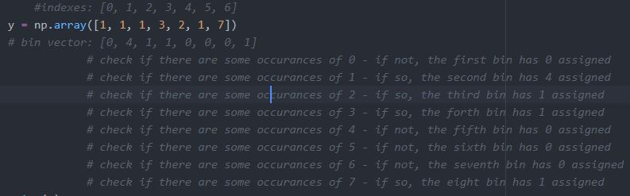

<h2>Decision Tree</h2>
<h3>Intro</h3>
<ul>
  <li>The root node branches off to a number of solutions based on a sample features condition.</li>
  <li>We need to quantify how much a question reduces the uncertainity using the information gain concept</li>
</ul>

<h3>Label prediction for a new sample</h3>
<ul>
  <li>Traversing tree recursively.</li>
  <li>During recursion, it takes a look at the node's best split feature aginst a new sample feature.</li>
  <li>Moving on to left or right node depending on the test condition for a new sample feature.</li>
</ul>

<h3>Demo</h3>
<ul>
  <li>When new sample comes in, then we start from the root node traversing tree untill the leaf node where we can assign a label.</li>
  <li>Based on the features of the sample we can define the labels, f.e. 1 or 0.</li>
  <li>On every split step we need to come up with <b>the best split value (when text feature)</b> or <b>the best split threshold</b> (when numeric feature).</li>
</ul>

<h2>Math with Numpy</h2>
<h3>numpy.bincounter</h3>
<ul>
  <li>Counts number of occurences of each value in non-negative ints array.</li>
  <li>The number of bins is one larger than the largest value in an input array.</li>
  <li>Each bin gives the number of occurrences of its index value in x</li>
   
  
</ul>
